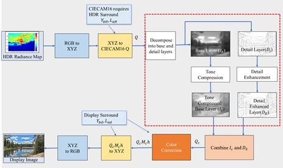
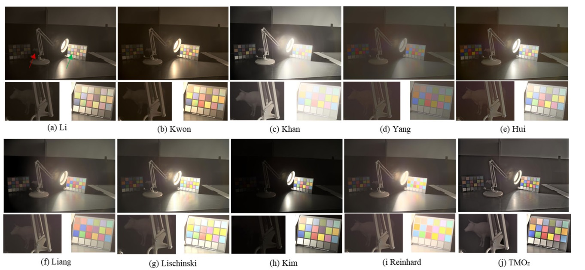
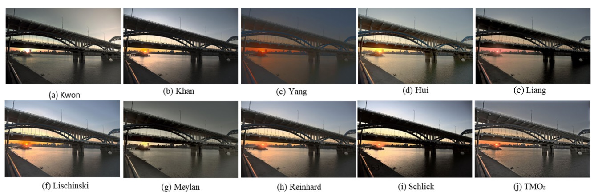
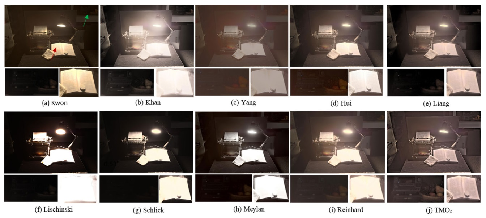
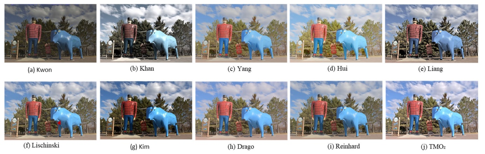
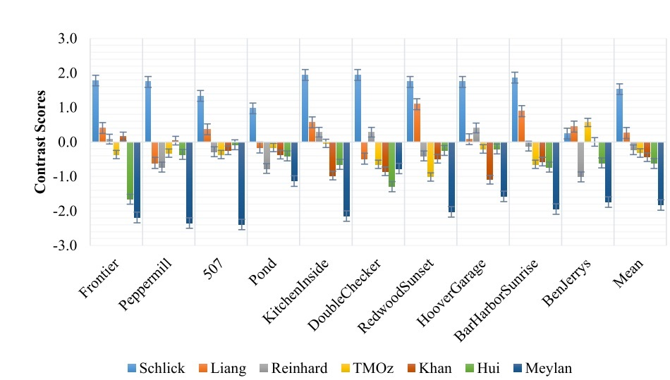
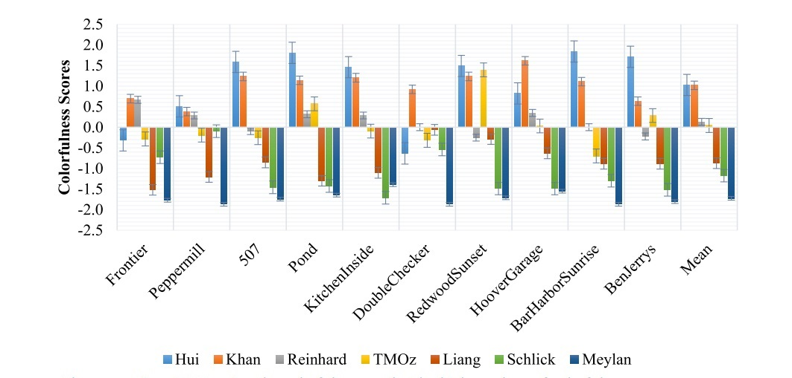
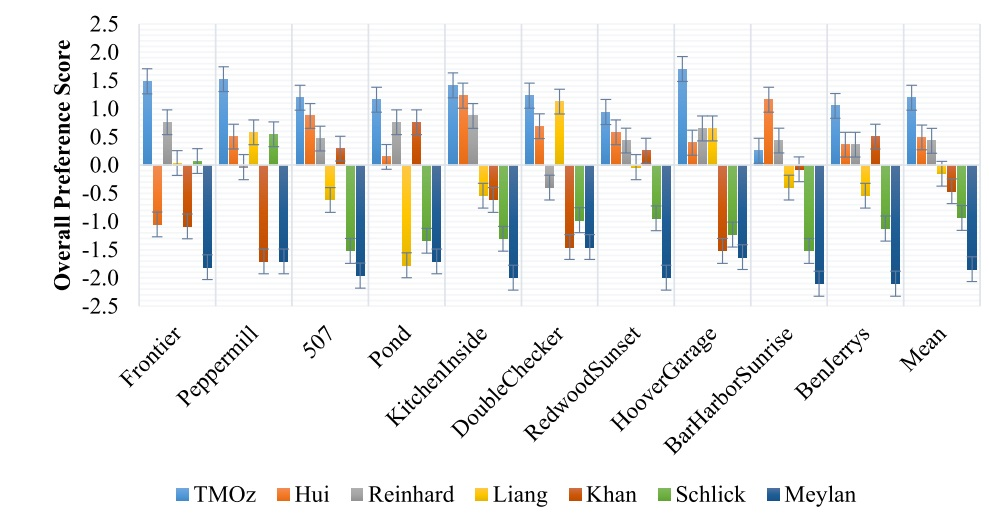

# Perceptual Tone Mapping Model for High Dynamic Range Imaging

**Digital Object Identifier:** [https://doi.org/10.1109/ACCESS.2023.3320809](https://doi.org/10.1109/ACCESS.2023.3320809)

## Abstract

Traditional tone mapping operators (TMOs) compress the luminance of high dynamic range (HDR) images without considering the surround and display conditions, leading to suboptimal results. In this work, we propose a TMO (TMOz) that leverages CIECAM16 perceptual attributes, i.e., brightness, colorfulness, and hue. TMOz accounts for the effects of both the surround and the display conditions to achieve more optimal colorfulness reproduction. The perceptual brightness is compressed, and the perceptual color scales, i.e., colorfulness and hue, are derived from HDR images. It estimates the colorfulness from HDR images by employing CIECAM16 color adaptation equations and restores the hue from HDR images. A psychophysical experiment was conducted to automate the brightness compression parameter. Hence, this model employs an adaptive and fully automatic approach, obviating the requirement for manual parameter selection. The objective and subjective evaluation methods revealed that the proposed model outperforms state-of-the-art TMOs.

## Index Terms

CIECAM16, high dynamic range, TMOz, tone mapping, perceptual tone mapping

## Introduction

High dynamic range (HDR) imaging provides an unlimited tonal range and prioritizes the preservation of fine details, enhancing visual experiences in various applications. However, most consumer display devices are not equipped to handle such rich visual content. Tone mapping algorithms adjust the tonal range of HDR data to match device capabilities, which can lead to a decrease in the original quality of HDR content.

Numerous TMOs have been proposed, each with varying effectiveness depending on the scenario. Recent TMOs often focus on preserving color ratios and manipulating luminance, which can result in hue shifts and color distortions. This paper introduces TMOz, which utilizes CIECAM16 to address these challenges effectively.

## Proposed Model

The flowchart of TMOz is illustrated in Figure 1. The input to TMOz is XYZ HDR data acquired from an HDR image. The model employs CIECAM16 to compute perceptual attributes such as brightness, colorfulness, and hue, considering the surround conditions for accurate color reproduction.
                                                    #### Workflow

### Brightness Calculation

The algorithm begins with the calculation of standard CIECAM16 parameters, including adaptation luminance and background luminance, essential for predicting appearance attributes.

### Brightness Decomposition

Brightness is decomposed into base and detail layers to preserve local contrast and reduce halo artifacts. The base layer undergoes tone compression, while the detail layer enhances local contrast.

### Colorfulness and Hue Calculation

The hue for the tone-mapped image is computed directly from the HDR image, with colorfulness adapted using CIECAM16 under display conditions. This ensures optimal color reproduction in the final output.

## Evaluation

### Visual Comparison

Here are three examples comparing TMOz with other TMOs:

#### Example 1: Visual Comparison

#### Example 2: Visual Comparison

#### Example 3: Visual Comparison

#### Example 3: Visual Comparison

## Psychophysical Performance Comparison

### Contrast Scale Comparison

**FIGURE 15.** The comparison TMOs using contrast scale. The higher values of contrast scores indicate high contrast images. TMOz achieved moderate contrast ranking in the middle.

### Colorfulness Scale Comparison

**FIGURE 16.** The comparison TMOs using the colorfulness scale. The higher values of colorfulness scores indicate images with high colorfulness. TMOz ranked in the middle for the colorfulness scale.

### Overall Preference Ranking

**FIGURE 17.** The overall ranking of the TMOs based on the overall preference scale. TMOz ranked first due to moderate contrast, moderate colorfulness, more naturalness, and better structuredness (as reported using objective metrics).

## Conclusion

This work presents TMOz, a CIECAM16-based tone mapping model that effectively addresses the challenges of HDR imaging. The model's ability to adapt colorfulness and hue from HDR images ensures more precise color reproduction. Both objective and subjective evaluations validate the superiority of TMOz over existing TMOs.

## References

1. Y. Huang et al., "Learning representations for high-dynamic-range image color transfer in a self-supervised way," IEEE Transactions on Multimedia, vol. 23, pp. 176-188, 2020.
2. A. Bhandari and F. Krahmer, "HDR imaging from quantization noise," in 2020 IEEE International Conference on Image Processing (ICIP), 2020: IEEE, pp. 101-105.
3. F. Banterle et al., Advanced high dynamic range imaging. CRC press, 2017.
4. R. Mantiuk et al., "Color correction for tone mapping," Computer Graphics Forum, vol. 28, no. 2, pp. 193-202, 2009.
5. G. W. Larson et al., "A visibility matching tone reproduction operator for high dynamic range scenes," IEEE Transactions on Visualization and Computer Graphics, vol. 3, no. 4, pp. 291-306, 1997.
6. E. Reinhard et al., "Photographic tone reproduction for digital images," in Proceedings of the 29th annual conference on Computer graphics and interactive techniques, 2002, pp. 267-276.

